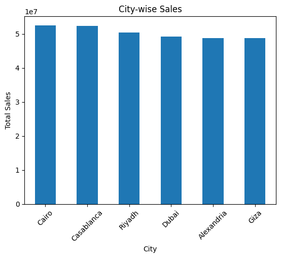
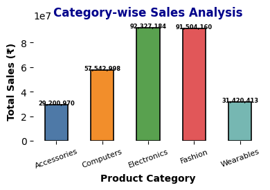
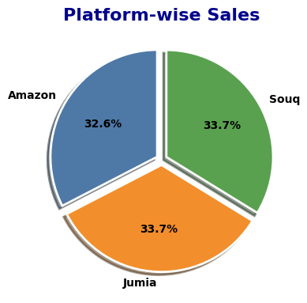
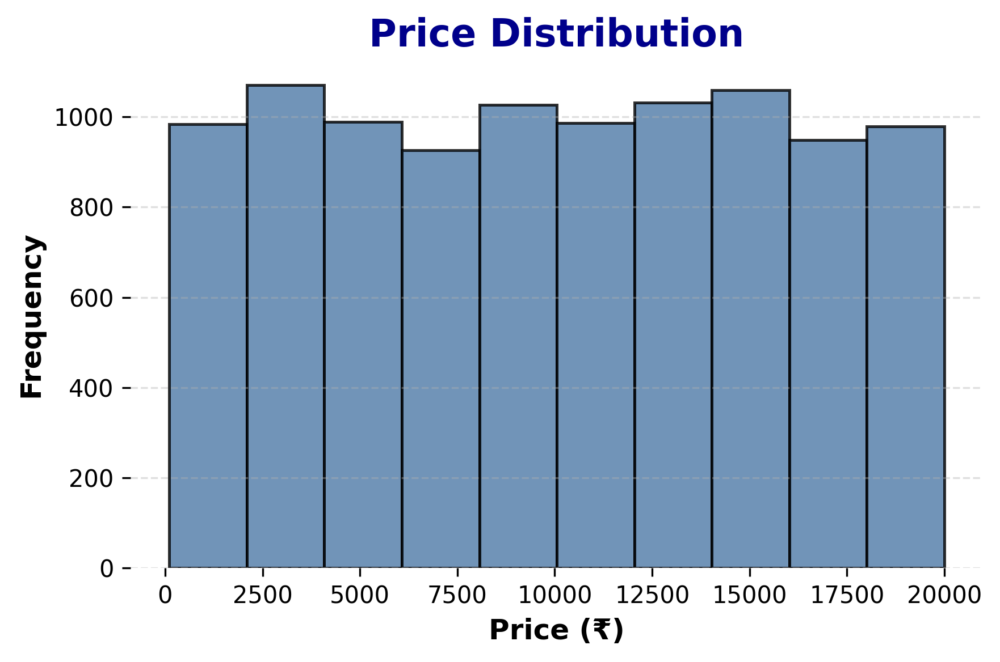

# 📊 Python Data Analysis Project

## 📌 Project Overview
This project is based on data analysis using Python. The main goal is to clean, analyze, and visualize data to generate meaningful business insights.

---

## 🛠 Tools & Technologies Used
- Python 🐍
- Pandas
- NumPy
- Matplotlib
- Jupyter Notebook (VS Code)

---

## 📂 Dataset
The dataset used in this project was obtained from Kaggle, a popular platform for datasets and data science projects.

Source: https://www.kaggle.com/

---

## 📊 Steps Performed
1. Data Cleaning (handling missing values)
2. Data Exploration (using Pandas)
3. Data Visualization (bar chart, pie chart, etc.)
4. Insight Generation

---

## 📊 City Wise Sales

## 📊 Category Wise

## 📊 Platform Wise Sales

## 📊 Price Distribution

## 📈 Key Insights
- Certain categories generate higher sales than others.
- Platform-wise sales show clear differences in performance.
- Some months have peak sales trends.

---

## 📌 Conclusion
This project helps in understanding sales patterns and improving data-driven decision making.

---

## 👩‍💻 Author
Kavita
